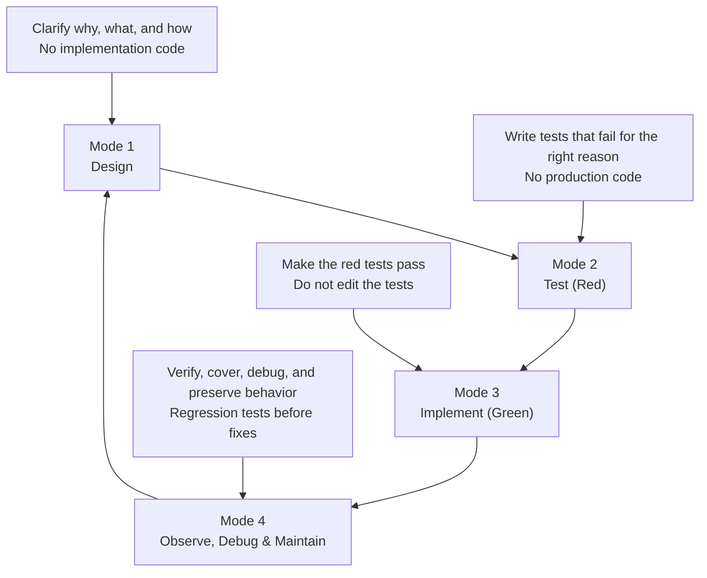

# joedevflow

## Install

```bash
npx skills add JoeCardoso13/joedevflow
```

This uses Vercel Labs' `skills` CLI to add `joedevflow` to your local agent skills setup. It installs the `SKILL.md` package so supported coding agents can discover it.

## Usage

Use `joedevflow` when an agent is building a feature, creating an MVP, refactoring code, fixing a bug, or doing any task that involves writing or changing implementation code.

The skill accepts an optional mode argument:

| Argument | Starts in |
| --- | --- |
| `design` | Mode 1 - Design |
| `test` | Mode 2 - Test (Red) |
| `implement` | Mode 3 - Implement (Green) |
| `debug` | Mode 4 - Observe, Debug & Maintain |

If no argument is provided, the agent reads `HANDOFF.md` when present. Otherwise, it asks which mode to start in.

```text
                         joedevflow

            separation of concerns for agentic SWE work

        +----------------------+     +----------------------+
        |  1. DESIGN           | --> |  2. TEST (RED)       |
        |  shape the contract  |     |  prove the contract  |
        +----------------------+     +----------------------+
                    ^                            |
                    |                            v
        +----------------------+     +----------------------+
        |  4. OBSERVE, DEBUG   | <-- |  3. IMPLEMENT        |
        |     & MAINTAIN       |     |     (GREEN)          |
        +----------------------+     +----------------------+

             think -> test -> build -> verify -> maintain
```

## The Four Modes

### 1. Design

Design establishes the contract for the work before code is written.

The agent focuses on the problem, requirements, architecture, tradeoffs, and implementation plan. The output should be specific enough that tests can be written from it.

### 2. Test (Red)

Test mode turns the design into executable expectations.

The agent writes tests before implementation. Those tests should fail at assertions, not because of missing imports, broken setup, or vague scaffolding. A test that cannot fail for the right reason is worse than no test.

### 3. Implement (Green)

Implementation mode is constrained by the red tests.

The agent writes production code to make the tests pass. It does not edit the tests in this mode. If a test appears wrong, the agent stops and asks instead of quietly changing the specification.

### 4. Observe, Debug & Maintain

The final mode verifies that the system behaves correctly outside the narrow implementation loop.

The agent runs coverage, looks for untested lines, adds end-to-end checks where appropriate, investigates failures, and treats bug fixes as maintenance work. Bugs should be reproduced with a regression test before the fix is written.

## Handoffs

Each mode ends by writing a `HANDOFF.md` file at the repository root. The handoff is the canonical summary of the current state of work:

- What mode just ran
- What goal it pursued
- What inputs it used
- What files changed
- What outputs were produced
- What risks or open questions remain
- What mode should happen next

Effective agent engineering depends on using context windows deliberately. `HANDOFF.md` lets independent agents work in separate context windows without sharing the whole conversation history. The human in the loop has the option to decide, on each mode transition, exactly how to orchestrate the different agents and their context windows.

## Workflow


